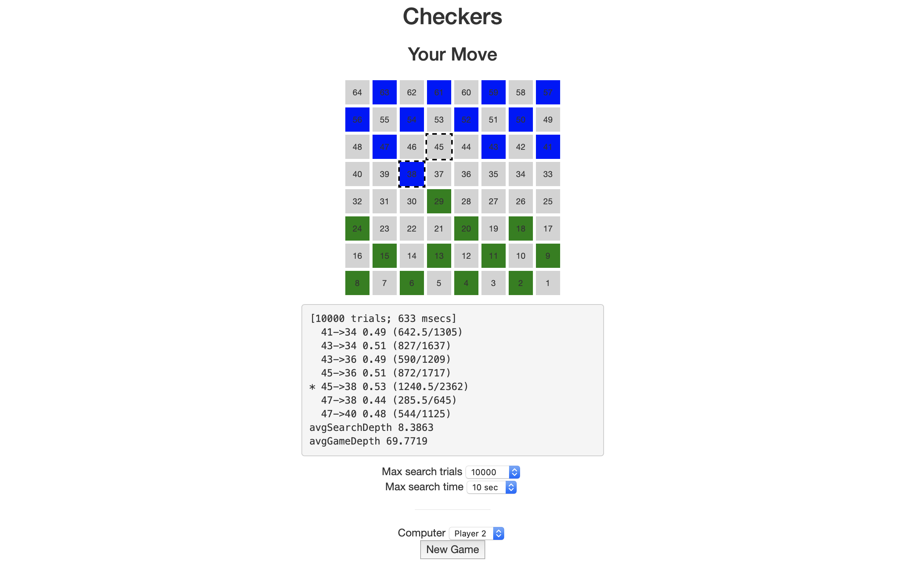
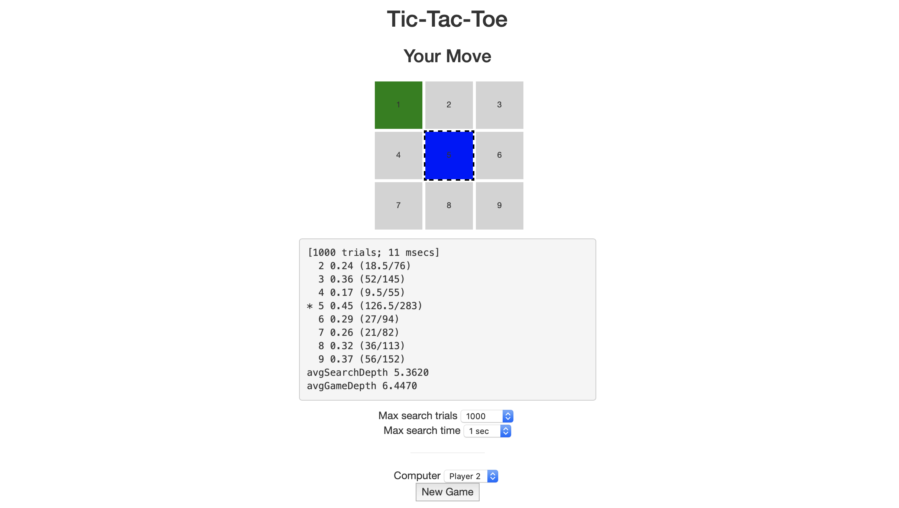

# JSMCTS

JSMCTS is a javascript implementation of <a href="https://en.wikipedia.org/wiki/Monte_Carlo_tree_search">Monte Carlo Tree Search (MCTS)</a> that can be used to implement game playing AIs that run entirely in a web browser.



Simulations can also be run on the command line using <a href="https://nodejs.org">Node.js</a>, pitting two MCTS players against each other, or a MCTS player against a random player or heuristic player.

## Monte Carlo Tree Search

Game playing AIs based on Monte Carlo Tree Search (MCTS) don't need to know anything about a game other than the rules.
In particular, they don't need to be taught any game-specific strategies.

MCTS evaluates moves through random game play, over many trials, building a search tree with estimated probabilities of winning for each possible move.
The best move is then selected to play.
The more <a href="https://en.wikipedia.org/wiki/Game_complexity">complex</a> a game is, the more time MCTS will need to explore the game tree in order to select a good move.

This survey paper is a great resource for learning more about MCTS:

C. B. Browne et al., "A Survey of Monte Carlo Tree Search Methods,"
in IEEE Transactions on Computational Intelligence and AI in Games, vol. 4, no. 1, pp. 1-43, March 2012,
https://doi.org/10.1109/TCIAIG.2012.2186810

JSMCTS uses Upper Confidence Bounds for Trees (UCT) to guide exploration of the game tree and random playout to evaluate moves.
Determinization is implemented for nondeterministic games using a seedable psuedo random number generator (xorshift128+).

## Examples

Four example games are provided that you can <a href="https://grwhitehead.github.io/jsmcts">play in your web browser</a>:
* Tic-Tac-Toe
* Connect Four
* Checkers
* Backgammon

### Game Implementation

[See js/tictactoe.js for full details]

Subclass Action for each move type in your game.
For Tic-Tac-Toe we record the cell where we will make our mark.
```
exports.Action = function(p) {
    mcts.Action.call(this);

    this.pos = p;
};

exports.Action.prototype = Object.create(mcts.Action.prototype);
```

Subclass Game and define your game state.
For Tic-Tac-Toe we define the 3x3 board as an array.
```
exports.Game = function(o) {
    if (o instanceof exports.Game) {
        // copy game
        mcts.Game.call(this, o);
        this.board = o.board.slice();
    } else {
        // initialize new game
        mcts.Game.call(this, { nPlayers: 2 });
        this.board = [0, 0, 0,
                      0, 0, 0,
                      0, 0, 0];
    }
};

exports.Game.prototype = Object.create(mcts.Game.prototype);
```

Implement allActions() for your game, returning all legal actions for the current player given the current game state.
For Tic-Tac-Toe we return an action for each empty cell.
```
exports.Game.prototype.allActions = function() {
    var as = [];
    for (var i = 0; i < this.board.length; i++) {
        if (this.board[i] == 0) {
            as.push(new exports.Action(1+i));
        }
    }
    return as;
};
```

Implement doAction(a) for your game, applying the specified action and updating winner and currentPlayer.
For Tic-Tac-Toe we mark the specified cell with the current player's token and then check for a completed line or a draw.
```
exports.Game.prototype.doAction = function(a) {
    mcts.Game.prototype.doAction.call(this, a);
    this.board[a.pos-1] = this.currentPlayer;
    var e = false;
    for (var i = 0; i < lines.length; i++) {
        var line = lines[i];
        var n1 = 0;
        var n2 = 0;
        for (var j = 0; j < line.length; j++) {
            switch (this.board[line[j]]) {
            case 1:
                n1++;
                break;
            case 2:
                n2++;
                break;
            case 0:
                e = true;
            }
        }
        if (n1 == 3) {
            this.winner = 1;
            break;
        }
        if (n2 == 3) {
            this.winner = 2;
            break;
        }
    }
    if (!this.isGameOver()) {
        if (!e) {
            this.winner = 0;
        } else {
            this.currentTurn++;
            this.currentPlayer = (this.currentPlayer%2)+1
        }
    }
};
```

#### Nondeterministic Games

[See js/backgammon.js for full details]

Pass `nondeterministic: true` to the mcts.Game constructor and use `this.rng.random()` for chance elements in your implementation.

```
exports.Game = function(o) {
    if (o instanceof exports.Game) {
        // copy game
        mcts.Game.call(this, o);
        
        ...
        
    } else {
        // initialize new game
        mcts.Game.call(this, { nondeterministic: true, nPlayers: 2 });
        
        ...
        
        while (true) {
            this.roll = [Math.ceil(6*this.rng.random()), Math.ceil(6*this.rng.random())];
            if (this.roll[0] != this.roll[1]) break;
        }
        this.moves = this.roll.slice();
        this.first = (o && o.first)?o.first:1;
        if (this.first > 0) {
            this.currentPlayer = this.first;
        } else if (this.roll[0] > this.roll[1]) {
            this.currentPlayer = 1;
        } else {
            this.currentPlayer = 2;
        }
    }
};
```

### Heuristic Players

Heuristic players can be implemented to run against MCTS players.

[See js/tictactoe.js for full details]

Subclass Player for your heuristic player.
For Tic-Tac-Toe we create a rules-based perfect player.
```
/*
 * PerfectPlayer
 *
 * Rule-based perfect player strategy from
 * Crowley, K. and Siegler, R.S. (1993), Flexible Strategy Use in Young Children's Tic-Tac-Toe.
 * Cognitive Science, 17: 531-561. https://doi.org/10.1207/s15516709cog1704_3
 */
exports.PerfectPlayer = function() {
    mcts.Player.call(this);
};

exports.PerfectPlayer.prototype = Object.create(mcts.Player.prototype);
```

Implement getAction() for your player, returning an action for the current player given the current game state.
For Tic-Tac-Toe we use the rules outlined in the referenced paper.
```
exports.PerfectPlayer.prototype.getAction = function(g) {
    // Win
    var moves = this.winMoves(g, g.currentPlayer);
    if (moves.length > 0) return new exports.Action(1+moves[Math.floor(Math.random()*moves.length)]);
    // Block
    var moves = this.winMoves(g, 3-g.currentPlayer);
    if (moves.length > 0) return new exports.Action(1+moves[Math.floor(Math.random()*moves.length)]);
    // Fork
    var moves = this.forkMoves(g, g.currentPlayer);
    if (moves.length > 0) return new exports.Action(1+moves[Math.floor(Math.random()*moves.length)]);
    // Block Fork
    var moves = this.forkMoves(g, 3-g.currentPlayer);
    if (moves.length > 0) {
        // Deny opponent forks by forcing them to block somewhere else
        // (an essential strategy to avoid double-forks)
        var moves2 = this.forceBlockMoves(g, g.currentPlayer, moves);
        if (moves2.length > 0) {
            return new exports.Action(1+moves2[Math.floor(Math.random()*moves2.length)]);
        }
        return new exports.Action(1+moves[Math.floor(Math.random()*moves.length)]);
    }
    // Empty Center
    if (g.board[4] == 0) return new exports.Action(1+4);
    // Opposite Corner
    var moves = this.oppositeCornerMoves(g, 3-g.currentPlayer);
    if (moves.length > 0) return new exports.Action(1+moves[Math.floor(Math.random()*moves.length)]);
    // Empty Corner
    var moves = this.emptyCornerMoves(g);
    if (moves.length > 0) return new exports.Action(1+moves[Math.floor(Math.random()*moves.length)]);
    // Empty Side
    var moves = this.emptySideMoves(g);
    if (moves.length > 0) return new exports.Action(1+moves[Math.floor(Math.random()*moves.length)]);
};
```

### Web UI

[See tictactoe.html for full details]



### Running Simulations

[See simtictactoe.js for full details]

```
% ./run.sh simtictactoe.js
Usage: ./run.sh simtictactoe.js [options]

Available options:
  -n, --nruns NUMBER   Number of runs
  -p, --player NAME    Player

Available players:
  random
  mcts10
  mcts100
  mcts1000
  mcts10000
  perfect
```

```
% ./run.sh simtictactoe.js -p mcts1000 -p perfect -n 1
run 1
...
...
...

currentTurn 1 currentPlayer 1
[1000 trials; 13 msecs]
  1 0.51 (23/45)
  2 0.57 (33.5/59)
  3 0.63 (56/89)
  4 0.41 (11.5/28)
* 5 0.77 (286.5/373)
  6 0.60 (45/75)
  7 0.62 (53.5/86)
  8 0.60 (45/75)
  9 0.70 (119.5/170)
avgSearchDepth 4.5500
avgGameDepth 7.5550
avgBranchingFactor 3.7995

...
.X.
...

currentTurn 2 currentPlayer 2
...
.X.
O..

[...]

currentTurn 9 currentPlayer 1
[0 trials; 0 msecs]
* 3 NaN (0/0)
avgSearchDepth 0.0000
avgGameDepth 0.0000
avgBranchingFactor 0.0000

XOX
XXO
OXO

draw

draw,mcts1000,perfect
1,0,0
1.00,0.00,0.00
```

## Requirements

To run simulations on the command line

* Node (https://nodejs.org)

On MacOS:
```
% brew install node
% npm install optparse
```

Copyright (c) 2022-2023 Greg Whitehead

MIT License
